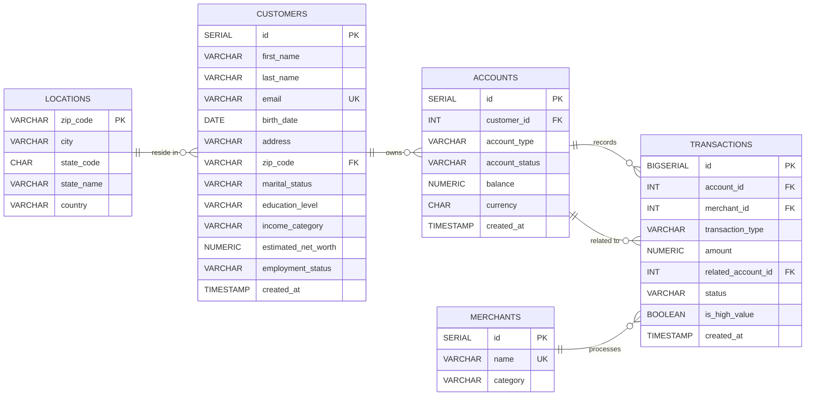

# Modern Data Stack for Banking Analytics
*An event-driven platform designed for comprehensive financial intelligence and executive decision-making.*

## 1. Executive Summary

This project implements a **Modern Data Stack (MDS)** designed to capture and analyze high-velocity financial transactions in real-time. By shifting from traditional batch processing to a **Change Data Capture (CDC)** architecture, the system provides an immutable, audit-ready pipeline that delivers immediate visibility into bank liquidity, high-value monitoring, and customer behavior.

### 🛠️ Tech Stack

**Key Achievements:**
* **Operational Transparency:** Provides real-time visibility into **$238M+ in assets**, enabling immediate tracking of intraday liquidity.
* **High-Value Monitoring:** Powers specialized dashboards to highlight transactions exceeding **$50,000**, ensuring proactive compliance oversight.
* **Modular Ingestion:** Orchestrated a decoupled ecosystem involving Kafka, Snowflake, and dbt to balance ingestion speed with analytical power.

---

## 2. System Architecture

The pipeline follows a modular **ELT (Extract, Load, Transform)** pattern, ensuring that data ingestion is decoupled from downstream business logic.

* **Source Layer:** A **PostgreSQL** instance serves as the transactional "Source of Truth".
* **Ingestion Layer (CDC):** **Debezium** monitors the Postgres Write-Ahead Log (WAL), capturing every INSERT and UPDATE as an event without impacting database performance.
* **Streaming & Storage:** Events are published to **Apache Kafka**. A Python consumer applies specialized buffering logic to save data as compressed **Parquet** files in **MinIO** (S3-compatible storage).
* **Warehouse Layer:** **Snowflake** acts as the centralized analytical store. **Airflow** DAGs orchestrate the movement of raw data from the lake into `VARIANT` tables.
* **Transformation Layer:** **dbt** (Data Build Tool) executes the SQL modeling required to turn raw JSON into a clean, audited Star Schema.
* **Visualization Layer:** **Power BI** delivers an executive analytics suite for Strategy, Merchant Intelligence, and Risk Management.

---

## 3. Data Model

The underlying relational structure ensures strict financial consistency across customers, accounts, and the transactional ledger.

---

## 4. Technical Deep-Dive

### 🏗️ Ingestion Logic: Dual-Trigger Flush
To balance data availability with storage efficiency, the Kafka consumer implements a custom buffering logic. A "flush" to the Data Lake is triggered when **one** of two conditions is met:
* **Record Count**: The buffer reaches **300 records**.
* **Time Duration**: A **30-second timer** expires.

**Partitioned Storage Structure:**
* **Topic-Based Isolation**: Each Kafka topic is mapped to its own folder in **MinIO**.
* **Time-Series Partitioning**: During ingestion, files are organized into daily archive folders (e.g., `archives/table_name/YYYY-MM-DD/`) for efficient historical lookups.

### ❄️ Snowflake & dbt Transformation
The system organizes data through a **Medallion Architecture**, moving from Bronze (Raw VARIANT data) to Gold (Business-ready Star Schema).
* **SCD Type 2 Snapshots**: dbt snapshots track historical changes in customer profiles (e.g., income shifts) without overwriting records.
* **Late-Binding Facts**: Transaction facts join against dimension states at query time, ensuring transactions link to the customer’s profile state **at the exact moment it occurred**.

### ⚙️ Operations & Quality Control
**Apache Airflow** serves as the "Central Nervous System," managing complex dependencies via modular DAGs.
* **Ingestion (DAG_001)**: Uses `check_infra` logic to verify environment stability before automating bulk `PUT` and `COPY INTO` operations into Snowflake.
* **Transformation (DAG_002)**: Executes dbt staging, snapshots, and mart builds followed by **dbt-test** to validate schema integrity and referential consistency.

---

## 5. The Analytics Suite

The final layer of the stack is an Executive Analytics suite in **Power BI**, providing specialized insights across four key areas:

### 🏛️ Executive Strategy & Liquidity
 
* **Insight**: Tracks **$238M+ in Assets Under Management (AUM)** and intraday transaction velocity to ensure operational stability.

### 👤 Customer 360 & Wealth Segmentation

* **Insight**: Analyzes demographics and wealth categories (Low to Ultra High), identifying high-value segments for targeted services.

### 🛍️ Commerce & Merchant Intelligence

* **Insight**: Monitors market share for top merchants and tracks **Preferred Payment Rails** (Salary, Purchase, Wire, etc.).

### 🛡️ Portfolio Risk & Financial Crimes

* **Insight**: Visualizes net capital flow and maintains a **High-Value Watchlist** for monitoring significant cash movements.

---

## 6. Setup & Installation Guide

This project is fully containerized using **Docker** to ensure environment parity across development and production stages.

### 1. Environment Preparation
* **Clone the Repository**: Start by cloning the project to your local machine: `git clone https://github.com/goutham2222/banking-modern-datastack`.
* **Dependency Management**: Ensure Python 3.9+ is installed, then install the required libraries: `pip install -r requirements.txt`.
* **Configuration**: Create a `.env` file in the root directory. You must provide credentials for **Snowflake** (Account, User, Password, Warehouse), **Postgres**, and **MinIO** to allow the components to communicate.

### 2. Pipeline Execution Sequence
To successfully run the end-to-end flow, follow this specific order of operations:

1.  **Spin up Infrastructure**: Run `docker-compose up -d`. This initializes the core ecosystem, including the Postgres database, Kafka/Zookeeper bus, MinIO object storage, and the Airflow webserver.
2.  **Establish CDC Link**: Register the Debezium connector by running `python kafka-debezium/connector.py`. This tells Debezium to begin monitoring the Postgres Write-Ahead Log (WAL). 
3.  **Activate Data Stream**:
    * **Generator**: Run `python data-generator.py` to simulate a live banking environment with random customer joins and transactions.
    * **Streamer**: Run `python stream_to_datalake.py`. This service consumes Kafka events and applies the **Dual-Trigger Flush** logic to land Parquet files in MinIO.
4.  **Orchestrate Workflows**: Access the Airflow UI (typically at `localhost:8080`) and toggle the following:
    * **DAG_001**: Triggers the automated movement of data from the MinIO Landing zone into Snowflake `VARIANT` tables.
    * **DAG_002**: Executes the dbt transformation pipeline, including staging, SCD Type 2 snapshots, and final mart creation.

---

## 7. Path to Enterprise Deployment

While this project implements high-fidelity patterns, transitioning to a global production banking environment requires specific "hardening" for compliance and extreme availability.

### Security & Data Governance
* **PII & Data Masking**: To comply with financial privacy laws like **GDPR** or **CCPA**, sensitive customer data (emails, SSNs, addresses) would undergo **Dynamic Data Masking** or hashing before ever landing in the Data Lake.
* **Enterprise Secret Management**: Local `.env` files would be replaced with managed vault solutions like **AWS Secrets Manager** or **HashiCorp Vault** to rotate and protect sensitive database credentials.
* **Audit Trail Encryption**: Implementation of end-to-end encryption for the Kafka message bus and **AES-256** at-rest encryption for the MinIO/S3 Data Lake ensures total financial data privacy.

### Scalability & Infrastructure Resilience
* **Cloud-Native Orchestration**: Containerized workloads would migrate from Docker to a managed Kubernetes service (**Amazon EKS** or **Google GKE**) to enable automated horizontal scaling during peak transaction periods.
* **Proactive Observability**: Integration of specialized monitoring tools (e.g., **Prometheus/Grafana**) and alerting platforms like **PagerDuty** or **Slack** to notify engineers of ingestion lag or pipeline failures in real-time.
* **Multi-Region Redundancy**: Deploying the infrastructure across multiple cloud availability zones to ensure the banking intelligence suite remains operational even during a major provider outage.

### Compliance & Quality Assurance
* **Automated Data Contracts**: Implementation of a **Kafka Schema Registry** to enforce strict data contracts, ensuring that upstream database schema changes do not break downstream analytical models.
* **Continuous Integrity Testing**: Expanding the existing **dbt-test** suite to include volumetric checks and automated financial reconciliation between the Transactional Source (Postgres) and the Analytical Warehouse (Snowflake).
