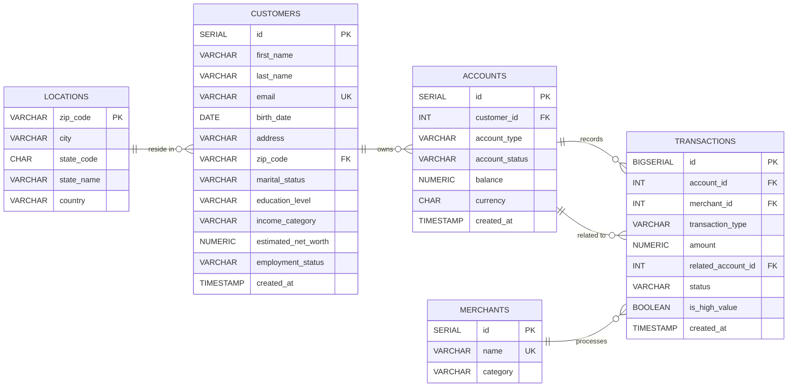

# Modern Data Stack for Banking Analytics
*An event-driven platform designed for comprehensive financial intelligence and executive decision-making.*

## 1. Executive Summary
Traditional banking systems often rely on legacy batch processing, leading to "stale" data that is 24 hours behind reality. This delay results in informed decision lag, reactive risk management, and liquidity blind spots for leadership. 

This project implements a **Modern Data Stack (MDS)** designed to capture database transactions as they happen. By shifting to a **Change Data Capture (CDC)** architecture, this system provides an immutable, audit-ready pipeline that delivers immediate visibility into bank liquidity, high-value monitoring, and customer behavior.

### 🛠️ Tech Stack

**Key Achievements:**
* **Operational Transparency:** Provides real-time visibility into **$238M+ in assets**, enabling immediate tracking of intraday liquidity.
* **High-Value Monitoring:** Powers specialized dashboards to highlight transactions exceeding **$50,000**, ensuring proactive compliance oversight.
* **Scalable Infrastructure:** Orchestrated a decoupled ecosystem involving Kafka, Snowflake, and dbt to balance ingestion speed with analytical power.

---

## 2. System Architecture

This pipeline follows a **Modular ELT (Extract, Load, Transform)** pattern, designed to decouple data ingestion from business logic.

* **Source Layer:** A **PostgreSQL** instance serves as the transactional "Source of Truth".
* **Ingestion Layer (CDC):** **Debezium** monitors the Postgres Write-Ahead Log (WAL), capturing every INSERT and UPDATE as an event without impacting database performance.
* **Streaming & Storage:** Events are published to **Apache Kafka**. A Python consumer applies specialized buffering logic to save data as compressed **Parquet** files in **MinIO** (S3-compatible storage).
* **Warehouse Layer:** **Snowflake** acts as the centralized analytical store. **Airflow** DAGs orchestrate the movement of raw data from the lake into `VARIANT` tables.
* **Transformation Layer:** **dbt** (Data Build Tool) executes the SQL modeling required to turn raw JSON into a clean, audited Star Schema.
* **Visualization Layer:** **Power BI** delivers an executive analytics suite for Strategy, Merchant Intelligence, and Risk Management.

---

## 3. Data Model
The underlying relational structure ensures strict financial consistency across customers, accounts, and the transactional ledger.

## 4. Technical Deep-Dive

### 🏗️ Solving the "Small Files" Hurdle
Moving to a streaming model often creates thousands of tiny, KB-sized files that cause massive I/O overhead in cloud warehouses. To solve this, the pipeline implements a custom **Dual-Trigger Flush** mechanism.

* **Logic & Tradeoff:** Data is buffered in memory and committed to the Data Lake only when the buffer reaches **300 records** OR a **30-second timer** expires.
* **Reasoning:** This controlled micro-batching results in a massive gain in **Snowflake ingestion efficiency** by preventing the compute-heavy overhead of loading fragmented files.

### ❄️ Snowflake & dbt Transformation
The system organizes data through a **Medallion Architecture**, moving from Bronze (Raw VARIANT data) to Gold (Business-ready Star Schema).

* **SCD Type 2 Snapshots:** Using dbt snapshots, the system tracks historical shifts in customer profiles (e.g., changes in income or marital status) without overwriting historical records.
* **Late-Binding Facts:** Transaction facts are joined against dimension states at query time, ensuring a transaction is linked to the customer’s exact profile state **at the moment it occurred**.

### ⚙️ Operations & Quality Control
The pipeline utilizes a **"Central Nervous System"** approach to manage complex dependencies.

* **Orchestration:** **Apache Airflow** serves as the orchestrator, using modular DAGs to separate infrastructure health from data movement. It provides a visual map of dependencies and handles complex retry logic.
* **Automated Testing:** Every transformation is validated via **dbt-test** for schema integrity and referential consistency before reaching the Gold layer. 
* **CI/CD:** Automated testing via **GitHub Actions** ensures that logic updates do not introduce inaccuracies into the financial reports.

## 5. The Analytics Suite

The final layer of the stack is a 5-page Executive Analytics suite in **Power BI**, designed to provide specialized insights for different banking departments.

### 🏛️ Executive Strategy & Liquidity
 
* **Summary:** Provides a high-level view of financial health by tracking **$238M+ in Assets Under Management (AUM)** and intraday transaction velocity.
* **Key Insight:** Allows leadership to monitor real-time liquidity across checking and savings accounts to ensure operational stability.

### 👤 Customer 360 & Wealth Segmentation

* **Summary:** Offers a deep dive into user demographics and geographic distribution across North America.
* **Key Insight:** Features high-value segmentation by comparing balances against net worth to identify **Ultra High** wealth categories for targeted banking services.

### 🛍️ Commerce & Merchant Intelligence

* **Summary:** Analyzes market share by volume for top retailers and breaks down spending distribution by sector.
* **Key Insight:** Tracks **Preferred Payment Rails**, showing how salary deposits and purchases constitute the majority of transaction volume.

### 🛡️ Portfolio Risk & Financial Crimes

* **Summary:** Visualizes net capital flow and maintains a **High-Value Watchlist** for monitoring significant cash movements.
* **Key Insight:** Highlights transactions exceeding **$50,000** within the Power BI interface and tracks system success rates to ensure audit-ready transparency.

---

## 6. Setup & Installation Guide
This project is fully containerized to ensure environment parity.

### 1. Environment Preparation
* **Clone the Repository:** `git clone https://github.com/goutham2222/banking-modern-datastack`.
* **Dependency Management:** Install required Python libraries: `pip install -r requirements.txt`.
* **Configuration:** Create a `.env` file in the root directory to manage your **Snowflake** and **Postgres** credentials.

### 2. Pipeline Execution Sequence
1. **Spin up Infrastructure:** Execute `docker-compose up -d` to initialize the containerized ecosystem (Postgres, Kafka, Zookeeper, MinIO, and Airflow).
2. **Establish CDC Link:** Register the Debezium connector: `python kafka-debezium/connector.py`.
3. **Activate Data Stream:** * `python data-generator.py` (Simulates live banking transactions).
    * `python stream_to_datalake.py` (Initiates dual-trigger ingestion to the MinIO lake).
4. **Orchestrate Workflows:** Access the **Airflow UI** to trigger:
    * **DAG_001:** Automates the movement of Parquet files from MinIO into Snowflake.
    * **DAG_002:** Executes dbt transformations and SCD Type 2 snapshots.

## 7. Path to Enterprise Deployment
Transitioning from this localized prototype to a global banking environment requires specific enterprise "hardening" to ensure compliance, security, and extreme availability.

### Security & Data Governance
* **PII & Data Masking**: To comply with financial privacy laws (GDPR/CCPA), sensitive customer data such as emails and physical addresses would undergo **Dynamic Data Masking** or hashing before landing in the Data Lake.
* **Enterprise Secret Management**: Transitioning from local configurations to managed solutions like **AWS Secrets Manager** or **HashiCorp Vault** to protect database credentials and API keys.
* **Audit Trail Encryption**: Implementing end-to-end encryption for the Kafka message bus and at-rest encryption for the MinIO/S3 Data Lake to ensure total financial data privacy.

### Scalability & Infrastructure Resilience
* **Cloud-Native Orchestration**: Migrating containerized workloads from Docker to a managed Kubernetes service (**Amazon EKS** or **Google GKE**) to enable high availability and auto-scaling.
* **Proactive Observability**: Integrating specialized alerting tools like **PagerDuty** or **Slack** to notify engineers of ingestion lag spikes or DAG failures.
* **Multi-Region Redundancy**: Deploying the pipeline across multiple cloud regions to ensure banking intelligence remains operational during localized provider outages.

### Compliance & Quality Assurance
* **Automated Data Contracts**: Implementing schema registries in Kafka to ensure that changes in the upstream PostgreSQL database do not break downstream Snowflake transformations.
* **Continuous Integrity Testing**: Expanding the existing **dbt-test** suite to include volumetric checks and financial reconciliation between the Transactional Source (Postgres) and the Analytical Warehouse (Snowflake).