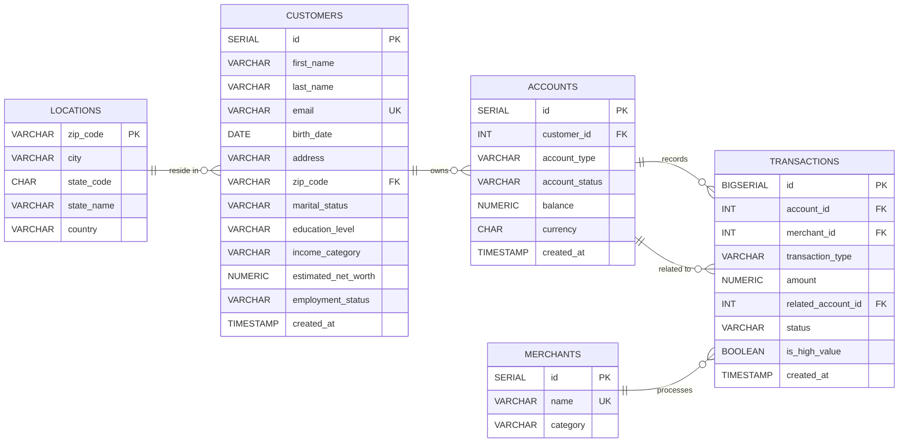

# Real-Time Banking Pipeline: Postgres to Snowflake via Debezium & Kafka
*An event-driven Modern Data Stack (MDS) designed for sub-second financial intelligence.*

## 1. Executive Summary
Traditional banking systems often rely on legacy batch processing, leading to "stale" data that is 24 hours behind reality. This project demonstrates a production-grade **Modern Data Stack (MDS)** that captures database transactions as they happen. By shifting to a Change Data Capture (CDC) architecture, this system provides immediate visibility into bank liquidity, high-value risk alerts, and customer behavior.

**Key Achievements:**
* **Real-Time Visibility:** Achieved an average end-to-end ingestion latency of **0.39s**.
* **Financial Integrity:** Managed $17M+ in simulated assets with automated audit trails.
* **Scalable Infrastructure:** Orchestrated a containerized ecosystem involving Kafka, Snowflake, and dbt.

---

## 2. System Architecture

This pipeline follows a **Modular ELT (Extract, Load, Transform)** pattern, moving data from a transactional source to an analytical warehouse.

* **Source Layer:** A **PostgreSQL** instance serves as the transactional heart of the bank, with a custom Python data generator simulating high-velocity banking activity.
* **Ingestion Layer (CDC):** **Debezium** monitors the Postgres WAL (Write Ahead Log), capturing row-level changes and publishing them to **Kafka**.
* **Storage Layer (Data Lake):** A **Python Kafka Consumer** batches events into **Parquet** files and flushes them to **MinIO** (S3-compatible storage) using a dual-trigger logic.
* **Warehouse Layer:** **Snowflake** acts as the centralized analytical store. **Airflow** DAGs orchestrate the bulk loading of raw data into `VARIANT` tables.
* **Transformation Layer:** **dbt** (data build tool) transforms semi-structured raw data into a clean Star Schema, implementing **SCD Type 2 snapshots** to track historical customer wealth changes.
* **Visualization Layer:** **Power BI** delivers real-time dashboards for Executive Strategy, Merchant Intelligence, and Risk Management.

---

## 3. Data Model
The underlying relational structure ensures strict financial consistency across customers, accounts, and the transactional ledger.

## 4. Technical Deep-Dive

### 🏗️ Streaming & Ingestion Logic
The heart of the ingestion layer is a custom Python Kafka Consumer that bridges the gap between a high-velocity message bus and a Parquet-based Data Lake.

* **CDC (Change Data Capture) Implementation**: Leveraged Debezium to stream row-level changes from PostgreSQL, ensuring that every `INSERT`, `UPDATE`, and `READ` event is captured with full context.
* **Throughput vs. Latency Balancing**: 
    * **The Problem**: High-volume transaction flushes were forcing low-volume tables (like `customers`) to create many tiny, inefficient Parquet files in MinIO. 
    * **The Solution**: Engineered a **Dual-Trigger Flush** mechanism in the Python consumer. Data is committed to storage only when a buffer of 300 records is met **OR** a 30-second timer expires. This ensures high-volume data moves fast while low-volume metadata remains current without taxing the storage layer.

### ❄️ Snowflake & dbt Transformation
Once data lands in Snowflake's `RAW` schema as semi-structured `VARIANT` types, it undergoes a multi-stage transformation.

* **SCD Type 2 Snapshots**: Implemented `dbt snapshot` logic to track historical changes in customer profiles (e.g., changes in marital status or income category) and account states.
* **Late-Binding Facts**: The `fact_transactions` table utilizes incremental materialization to process millions of records efficiently, joining against the `is_current` flag of dimension tables to ensure transactions are attributed to the correct customer profile at the time of occurrence.

## 5. The Analytics Suite

The final layer of the stack is a 5-page Executive Analytics suite, designed to provide specialized insights for different banking departments.

### 🏛️ Executive Strategy & Liquidity

* **Stakeholder Focus**: CFO / Head of Strategy.
* **Key Insights**: Monitors total **Assets Under Management (AUM)** and intraday transaction velocity.
* **Feature**: A real-time Area Chart showing the heartbeat of the bank's liquidity, allowing leadership to see capital movement as it occurs.

### 👤 Customer 360 & Wealth Segmentation

* **Stakeholder Focus**: Marketing / Product Managers.
* **Key Insights**: Breaks down the customer base by **Wealth Category** (Low, Medium, High, Ultra High) and geographic density.
* **Feature**: A Treemap visual that allows managers to drill down into specific demographic segments to tailor high-value product offerings.

### 🛍️ Commerce & Merchant Intelligence

* **Stakeholder Focus**: Partnerships / Commercial Banking.
* **Key Insights**: Identifies market share across top retailers (e.g., Luxury, Retail, Grocery).
* **Feature**: A Spend Category Funnel that visualizes where the bank's capital is flowing, highlighting dominant luxury merchants like Gucci and Mercedes-Benz.

### 🛡️ Portfolio Risk & Financial Crimes

* **Stakeholder Focus**: Compliance / Risk Officers.
* **Key Insights**: Tracks cash flow anomalies and "declined" transaction rates.
* **Feature**: A **High-Value Watchlist** table that sorts live transactions by amount, instantly flagging transfers over $50k for manual review.

### ⚙️ Data Platform & Pipeline Health

* **Stakeholder Focus**: Data Engineering Team.
* **Key Insights**: Real-time monitoring of the ingestion engine.
* **Feature**: A Gauge visual tracking **Ingestion Latency**, which currently maintains an elite benchmark of **0.39s** from Postgres to the dashboard.
